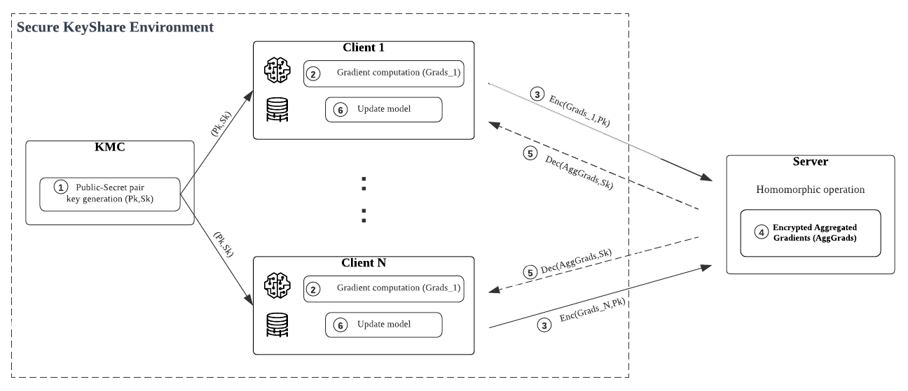

# This is an example of federated learning with Paillier homomorphic encryption using the flower framework. 





We use a Mnist NonIID partition with a Lenet model on the clients side. 

Clients can encrypt and decrypt thier local model parameters (encrypt & decrypt functions) using a Public-Secret key pair.

We define a server-side strategy called FedAvgHE, in which we aggregate the encrypted parameters sent by clients.

We use the [phe](https://pypi.org/project/phe/)  python library for Paillier-HE.

The process requires at least 4 parties : a model owner/ key generator, a server (that aggregate the weights), at least 2 data owner that train the model on their data
Please follow flower_with_containers README.md to build the docker image

```
# The folder will contain the files used and created by the model_owner
mkdir app_modelowner
cp model_owner.py app_modelowner/

# The folder will contain the files used and created by the server
mkdir app_server
cp model_owner.py app_server/
cp utils.py app_server/

# The folder will contain the files used and created by the client1
cp -r app_server app_client1

# The folder will contain the files used and created by the client1
cp -r app_server app_client2

cp server.py app_server/
cp FedAvgHE.py app_server/
cp client1.py app_client1/
cp client2.py app_client2/
```

Then create one container per entity

```
docker network create flower_network
docker run -d -it --network flower_network -v ./app_modelowner:/my_app/ --name model_owner flower-image
docker run -d -it --network flower_network -v ./app_server:/my_app/ --name server flower-image
docker run -d -it --network flower_network -v ./app_client1:/my_app/ --name client1 flower-image
docker run -d -it --network flower_network -v ./app_client2:/my_app/ --name client2 flower-image
```

1/ First the model_owner that is also key generator:
She generates the keys and choose the model architecture

```
docker exec -it model_owner bash
source .venv/bin/activate
cd /my_app/
python model_owner.py
```

This will create the keys, for now we have to copy both keys to the clients.
TODO: create a GRPC service for the model_owner such that only her own the private key and is able to decrypt on request for the clients.

```
cp app_modelowner/*pkl app_client1/
cp app_modelowner/*pkl app_client2/
cp app_modelowner/public_key.pkl app_server/
```


2/ Launch the server

```
docker exec -it server bash
source .venv/bin/activate
cd /my_app/
python server.py
```
2/ Launch the clients

```
docker exec -it client1 bash
source .venv/bin/activate
cd /my_app/
python client1.py
```

```
docker exec -it client2 bash
source .venv/bin/activate
cd /my_app/
python client2.py
```
